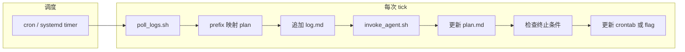

# Auto Research 轮询服务 — 实现路径（Review 稿）

面向：**Linux SSH Docker 容器**、目标为**最小可运行**、后续可替换 Agent 后端（Cursor CLI / 其他）。

---

## 1. 目标与边界

| 项目 | 说明 |
|------|------|
| **服务职责** | 定时唤醒 → 读摘要与训练产物 →（可选）调 Agent → 更新 `plan.md` / `log.md` → 判断是否结束轮询 |
| **不自包含** | 训练本身仍由现有 `nohup` / 训练脚本产生；服务**不替代** PyTorch 训练进程 |
| **Agent** | 若未安装 `cursor agent`，第一阶段用 **dry-run / 占位脚本** 验证管线；第二阶段再接 CLI |

**不在首版实现**：分布式多机、Web UI、复杂权限模型。

---

## 2. 总体架构



**单次 tick 顺序（必须固定，便于排错）**

1. **文件锁**（避免并发 tick）：`flock` 或 `mkdir .state/lock`。
2. **扫描**：在配置的 `RESULT_ROOT` 下发现**新于上次 checkpoint** 的 `nohup_train.log`（或通配模式）。
3. **关联 plan**：用 **路径 prefix**（见 §4）在 `plan.md` 中定位条目；若无则写入 `log.md` 一条 `unmapped` 并可选触发 Agent 补 `plan`。
4. **写 `log.md`**：仅追加极简一行/一段（见 §5），含超参摘要。
5. **调 Agent**：传入 `program.md` + 当前 `plan.md` + `log.md` +「本轮新日志路径列表」；输出为**受限**的补丁或命令清单（见 §7）。
6. **应用变更**：仅允许白名单操作（写 `plan.md`、追加 `log.md`、写 `.state`）。
7. **终止判定**：若满足 `program.md` 或 `plan.md` 中声明的停止条件 → 写 `.state/iteration_active=false` 并 **注释掉或删除** cron 行（或改 systemd timer `Persistent=false` + disable）。

---

## 3. 目录与配置（建议）

单仓库或单目录下集中管理（路径均可环境变量覆盖）：

```
auto-research-service/        # 或放在 KERMT/tlc/ 旁
├── program.md                # 硬约束：可改哪些文件、命令白名单、指标名
├── plan.md                   # 极简实验意图 + 正交轴 + 预期
├── log.md                    # 极简结果摘要（追加）
├── scripts/
│   ├── poll_tick.sh          # 主入口（cron 调用）
│   ├── scan_results.sh       # 扫描 RESULT_ROOT，输出新日志列表
│   ├── map_prefix_to_plan.sh # prefix → plan id（可 awk/sed）
│   ├── invoke_agent.sh       # 包装 cursor agent 或 dry-run
│   ├── apply_stop.sh         # 读状态，改 cron / systemd
│   └── install_cron.sh       # 安装：写 crontab 片段 + RESULT_ROOT
├── .state/
│   ├── last_scan.json        # 每个 log 文件 path → last_mtime / last_offset
│   ├── iteration_active      # 内容为 true/false
│   └── lock/                 # flock 用
└── IMPLEMENTATION_PATH.md    # 本文
```

**环境变量（示例）**

| 变量 | 含义 |
|------|------|
| `RESULT_ROOT` | 训练结果根目录，如 `/path/to/KERMT/tlc/results` |
| `LOG_GLOB` | 默认 `**/nohup_train.log`（用 `find` 实现，避免 bash globstar 差异） |
| `SERVICE_ROOT` | 本服务目录（含 plan/log/program） |
| `AGENT_BIN` | 默认 `agent`，不存在则走 dry-run |

---

## 4. Prefix ↔ Plan 映射规则（最小可运行约定）

**Prefix 定义（推荐）**：相对 `RESULT_ROOT` 的**父目录路径**，规范化后作 key，例如：

- 日志路径：`.../results/with_features_grover_scratch_datav2_ep200_es50_bs128/nohup_train.log`
- **prefix key**：`with_features_grover_scratch_datav2_ep200_es50_bs128`

**plan.md 中每条计划**必须包含同一字符串（作为锚点），例如一行：

`anchor: with_features_grover_scratch_datav2_ep200_es50_bs128`

这样无需「完美映射执行方案」，只要**训练输出目录命名与 plan 锚点一致**即可关联。

**多条训练共用一个策略**：同一 `anchor` 可对应多次 run（不同时间），`log.md` 用时间戳区分。

---

## 5. `plan.md` 极简 schema（满足：可展开 3 次测试 + 与已有正交）

设计原则：**短、结构化、机器可读优先**（YAML 小节或固定键），避免长文。

### 5.1 单条 plan 块模板

```yaml
### PLAN_ID: P3
anchor: with_features_grover_scratch_datav2_ep200_es50_bs128
axis: lr_wd          # 正交维度标签：与历史 axis 集合尽量不重复
intent: 在当前 backbone 下微调 lr 与 weight_decay
expect:
  metric: val_mae      # 与训练 log 解析规则一致
  op: lt
  threshold: 0.05
orthogonal_to: [P1, P2]   # 显式声明与哪些 plan 的 axis 正交（Agent 生成新 plan 时避轴）
expand: 3                 # 要求从本条生成 3 个可执行变体（具体命令/超参由 Agent 填到执行层，不必须写进 plan）
```

说明：

- **expand: 3**：约束 Agent / 执行器从该条目派生 **3 个不同 concrete trials**（例如 lr 三档、或 seed 三个）；具体数值可在首轮 Agent 输出写到 `.state/variants_P3.yaml`，不必挤进 `plan.md`。
- **axis**：新 plan 的 `axis` 应与 `log.md` 里已出现过的 `axis` 集合**尽量不同**，`orthogonal_to` 辅助 Agent 做显式避重复。
- **intent**：一行自然语言即可，用于生成策略，不要求等价于 shell。

### 5.2 全局区（可选，仍保持短）

```yaml
global_stop:
  metric: val_mae
  op: lt
  threshold: 0.04   # 全局达标则停轮询
```

---

## 6. `log.md` 极简 schema（追加）

每完成一次「新日志消化」，**追加一行**（或固定多行块），便于 diff 与 Agent 上下文。

**单行 CSV 风格（推荐，极简）**

```
TS=20260415T103000Z;PLAN=P3;ANCHOR=with_features_...;AXIS=lr_wd;MAE=0.052;STATUS=below_expect;HP=lr=2e-4,wd=0.01,bs=128,ep=200
```

字段约定：

| 字段 | 含义 |
|------|------|
| `TS` | ISO 时间 |
| `PLAN` | plan id |
| `ANCHOR` | prefix 锚点 |
| `AXIS` | 复制自 plan，便于正交统计 |
| `MAE` / 主指标 | 从 log **解析**（见 §8） |
| `STATUS` | `ok` / `below_expect` / `crash` / `unmapped` |
| `HP` | 超参键值对摘要（从 effective_config.yaml 或 log 头解析，规则在 `program.md` 固定） |

不要求能反推完整可复现实验；只要求 **可追溯 + Agent 可读**。

---

## 7. `program.md`（约束文档）应写死的条目

1. **可写文件**：仅 `plan.md`、`log.md`、`.state/**`、允许的 `cron` 安装脚本输出路径。
2. **禁止**：任意 `rm -rf /`、容器外路径、网络出站（若需要可放开 pip）。
3. **训练命令**：是否允许 Agent 直接启动训练；建议首版 **不允许**，只更新 plan，由人或其它 job 系统启动训练。
4. **指标解析**：例如从 `nohup_train.log` 用 `grep` 最后一行 `val_mae:` 或你们实际格式。
5. **停止条件**：全局阈值 + 「连续 K 次无改进」可选。

---

## 8. 训练 log 解析（与 KERMT/tlc 对齐）

在 `program.md` 中固定一种解析方式，例如：

- 优先：同目录 `effective_config.yaml` 若存在则读超参。
- 否则：从 `nohup_train.log` 正则提取 `val_xxx` 与关键 HP。

**prefix**：取父目录名已在 §4 说明。

---

## 9. Cron 生命周期（启动 / 结束迭代）

**启动**（安装）

- `install_cron.sh` 写入一行：每 `N` 分钟执行 `poll_tick.sh`。
- 写 `.state/iteration_active=true`。

**结束**（由 `apply_stop.sh` 或 `poll_tick.sh` 尾部调用）

- 条件：`global_stop` 或当前 active plan 的 `expect` 满足（在 `log.md` 最新若干行可判定）。
- 动作：
  - `.state/iteration_active=false`
  - **注释 cron 行**或调用 `crontab -l | sed` 删除对应行（容器内需同一用户 crontab）
  - 追加一行到 `log.md`：`TS=...;EVENT=iteration_stopped;REASON=threshold_met`

**注意**：若容器内 **无 cron**，改用 **宿主机 cron ssh 进容器执行** 或 **systemd timer**（文档里二选一写清）。

---

## 10. Agent 调用策略（未知是否安装 `agent`）

```bash
# invoke_agent.sh 伪代码
if command -v "${AGENT_BIN:-agent}" >/dev/null 2>&1; then
  agent -p --force "$(build_prompt)" 
else
  echo "[dry-run] would call agent with:" >&2
  build_prompt >&2
  # 可选：仅把 prompt 写入 .state/last_prompt.txt 供人工粘贴
fi
```

`build_prompt` 应包含：

- `program.md` 全文摘要或路径引用
- `plan.md` 全文
- `log.md` 最近 N 行
- 本轮新日志路径与解析出的指标
- 指令：**在约束内**更新 `plan.md`（新增/修改 plan 块）、追加 `log.md`、若达标输出 `STOP_ITERATION=1`

---

## 11. 最小可运行实验案例（验收标准）

1. 在 `RESULT_ROOT` 下放**一个**已存在的 `.../nohup_train.log`（可用旧 run）。
2. `plan.md` 中手写一条含正确 `anchor` 的块，`expect` 故意设为**达不到** → tick 一次 → `log.md` 多一行，`iteration_active` 仍为 true。
3. 手动把解析到的指标**改到满足**或改阈值 → 再 tick → `iteration_active=false`，cron 行被注释或删除。
4. 全程不依赖真实 `agent`（dry-run 路径）可跑通。

---

## 12. 分阶段落地（建议）

| 阶段 | 内容 | 产出 |
|------|------|------|
| **0** | 仅 `scan_results.sh` + `last_scan.json` + 打印新日志路径 | 验证路径与 mtime |
| **1** | 追加 `log.md`（不写 plan），手写 `program.md` 解析规则 | 可读的摘要行 |
| **2** | 接入 `map_prefix_to_plan` + plan 锚点 | 端到端映射 |
| **3** | `invoke_agent.sh` dry-run → 真 agent | 自动改 plan |
| **4** | 终止条件 + 改 cron | 完整闭环 |

---

## 13. 风险与缓解

| 风险 | 缓解 |
|------|------|
| Agent 改炸 `plan.md` | 提交前 `git diff` 校验 schema；或只接受 unified diff 到临时文件再 `patch` |
| cron 在容器内不运行 | 文档明确：宿主机 cron + ssh，或 supervisor 循环 sleep |
| 指标解析失败 | `STATUS=parse_error`，不触发 stop |
| 多 tick 并发 | 必须 `flock` |

---

## 14. 与你需求的对应关系（自检表）

- [x] 定时轮询**指定路径**下训练 log（通过 `RESULT_ROOT` + glob）
- [x] **prefix** 关联 plan 中策略与预期（**anchor** 行）
- [x] `log.md` 含结果 summary + 超参（单行约定）
- [x] Agent 在 **program.md** 约束下综合 `plan.md` + `log.md` 给新方案（由 `invoke_agent.sh` 提示词承载）
- [x] 达标后 **修改 cron** 结束迭代（`.state` + crontab）
- [x] plan **极简**，且 **expand:3** + **axis/orthogonal_to** 支持「三条具体测试」与「新 plan 与旧正交」

---

## 15. Review 已定决议（2026-04-15）

| 项 | 决议 |
|----|------|
| **plan.md 格式** | 采用 **YAML 小节**（见 §5）；脚本侧优先 `grep`/`awk` 解析 `anchor:`，可选装 `yq` 做结构化查询。 |
| **Agent 是否启动训练** | **允许**。在 `program.md` 中写明白名单命令（例如 `uv run …`、`nohup …/train.py`、`cd KERMT/tlc && python scripts/train.py --config …`），禁止任意 shell。 |
| **调度 / cron** | 见 **§15.1**（当前环境探测 + 容器内启用方式）；若仍不可用则用 **`while sleep` 守护进程** 作为等价物（同 tick 脚本）。 |
| **指标主键** | 仍建议在 `program.md` 中贴 **一行真实 `nohup_train.log` 样例**并锁定字段名（如 `val_mae` / `best valid`）。 |

### 15.1 Cron 可用性（已在当前 Linux 环境探测）

在本工作区容器内执行：`crontab` / `cron` **不在 PATH**（`type crontab` → not found），**不能假定默认可用**。

**若要使用 cron（推荐用于「真·定时」）**，在 Docker 镜像中需自行安装并启动守护进程，例如：

```bash
apt-get update && apt-get install -y cron
# 视基础镜像而定，常见为：
service cron start || /usr/sbin/cron
```

然后用 `crontab -e` 或 `install_cron.sh` 写入用户 crontab。若容器 PID1 不是 systemd，需确认 **`/usr/sbin/cron` 常驻**（或换用 `busybox crond` 等）。

**若不便跑 cron**：用同一套 `poll_tick.sh`，由 **宿主机 cron** `ssh` 进容器执行，或容器内 **`while true; do ./poll_tick.sh; sleep 300; done`** 后台运行（与 cron 等价，易排错）。

---

## 16. 来自 `autoresearch/` 可直接利用的「轮子」

以下指 **仓库** [`autoresearch`](https://github.com/karpathy/autoresearch)（你本机路径 `autoresearch/`），与 **auto-research-service** 目标对齐的部分；**不能**直接拿来跑 KERMT，但可 **复用模式与片段**。

| 资产 | 可直接怎么用 |
|------|----------------|
| **`program.md`** | **约束与 SOP 范本**：「可读/可改哪些文件」「禁止改哪些」「如何跑一轮实验」「如何记日志」。可裁剪迁移到本服务的 `program.md`（把 `train.py` 换成 KERMT 训练命令与结果路径）。 |
| **`results.tsv` 约定** | **实验登记表** 的列设计（commit、主指标、内存、status、description）。可平移到 `log.md` 单行字段或并行维护 `results.tsv`。 |
| **指标解析习惯** | `grep "^val_bpb:" run.log` 式 **稳定尾行指标**；TLC 侧用同样思路对 `nohup_train.log` 定正则。 |
| **`prepare.py` vs `train.py` 分工** | **固定 harness / 单一可变面**：对应 KERMT 侧「固定 `eval_and_plot` / `config_loader` + 仅允许 Agent 改配置或一条 `train` 封装」。 |
| **`analysis.ipynb`（及 README 进度图）** | 从表格或 log **画 progress** 的流程；可改为读 `log.md` 或 `RESULT_ROOT` 解析结果。 |
| **`pyproject.toml` + `uv`** | **可复现环境与单命令入口**（`uv run train.py`）；KERMT 若已用 conda/venv，仍在 `program.md` 里固定一条入口命令即可。 |
| **Git 分支流程**（`program.md` Setup） | `autoresearch/<tag>` 分支、首轮 baseline —— 可借鉴为「每轮迭代分支」或 tag，**非必须**。 |

| 一般**不**直接复用 | 原因 |
|---------------------|------|
| `train.py` / `prepare.py` 具体实现 | 面向 **LLM 预训练**（`val_bpb`、BPE、固定 5min），与 TLC 回归无关。 |
| `~/.cache/autoresearch` 数据管线 | 领域不同。 |

**你仓库内额外文档**：`autoresearch/KERMT_EXAMPLE.md`（若保留）可作为 **把 autoresearch 工作流映射到 KERMT** 的文字说明，与 auto-research-service 的 `plan.md`/`log.md` 设计互补，但 **不是可执行代码**。

---

*文档版本：已合并 §15 决议与 §16；指标样例仍建议在 `program.md` 补一行后冻结。*
