# harness-auto-research

**Agent harness** for autonomous ML experiment optimisation.

Cron-driven loop that polls training results, extracts metrics, manages
experiments via git, and invokes an AI agent (Cursor CLI) with full codebase
understanding via GitNexus knowledge graph — including code edits within
marked `AGENT-EDITABLE` blocks.

Inspired by [autoresearch](https://github.com/karpathy/autoresearch).

> **New: HARP is also a [Cursor / Claude Code skill](skill/SKILL.md).**
> If you have an agent-aware editor installed, you can skip the manual
> setup below — just `ln -s skill ~/.cursor/skills/harp` and ask the
> agent "set up HARP for repo X". See [`skill/INSTALL.md`](skill/INSTALL.md)
> and [`skill/EXAMPLES.md`](skill/EXAMPLES.md). Skill bundle ships
> `harp_init` (4-question wizard), `harp_status` (dashboard),
> `harp_polish` (Chinese log/memory/plan polishing in fresh chats),
> `harp_doctor` (10-check health), a polish daemon, and `harp_web`
> (FastAPI single-page UI: dashboard, config editor, log viewer with
> Chinese polish, action buttons with live SSE output).

## Quick start

### 0. one-time prerequisites

```bash
# Cursor agent CLI (the LLM driver HARP invokes every tick)
curl https://cursor.com/install -fsSL | bash      # installs to ~/.local/bin/agent
agent login                                       # browser flow, one-time

# Node >= 20 for GitNexus MCP (skip if `node --version` already prints v20+)
# AutoDL note: the cursor-server bundles its own node; harness will auto-detect.
```

Verify both with:

```bash
source env.sh && command -v agent && agent --version
node --version || ls /root/.cursor-server/bin/linux-x64/*/node
```

`env.sh` prepends `~/.local/bin` to `PATH`, so every harness script
finds `agent` automatically as long as you `source env.sh` first (the
shell scripts do; cron does too via the cron entry).

### 1. configure (the only file you edit in repo A)

For a brand-new project, edit a **single** file in A (the bootstrap
record) and `quickstart.sh` does the rest:

```bash
# Edit meta_info/project.yaml — the SOLE per-project input in A.
# It contains three sections rendered into B at init time:
#   harness:    -> B/harness.yaml      (targets, agent, schedule, ...)
#   userprompt: -> B/userprompt.yaml   (free-form rules for the agent)
#   cursorrules:-> B/.cursorrules      (project context for the LLM)
$EDITOR meta_info/project.yaml
```

See `meta_info/README.md` for the full schema; the file itself is
heavily commented.  Required minimum: set `harness.workspace.dir`,
`harness.targets[0].{name, repo_path, result_path, editable_files,
primary_metric, metric_op, stop_threshold}`, at least one
`userprompt.rules` entry, and a `cursorrules.header` block.

### 2. run

```bash
# one shot: validate meta_info, init workspace, GitNexus reindex,
# agent preflight, arm cron, set up workspace_remote (optional).
bash scripts/quickstart.sh
bash scripts/install_cron.sh install
```

After init, `meta_info/project.yaml` is **not** consulted again at
runtime (except `env.sh` reading `workspace.dir` to find B).  All
subsequent edits go to B:

```bash
$EDITOR $WORK_DIR/harness.yaml      # tweak targets/schedule/remote
$EDITOR $WORK_DIR/userprompt.yaml   # add or revise rules — auto-synced
                                    # to program.md USER-INJECTED next tick
```

`quickstart.sh` invokes the agent in **`--mode preflight`** (see
`check.md`).  In that one shot the agent:

- verifies `AGENT-EDITABLE-BEGIN/END` markers exist in every
  `editable_files` entry;
- picks the baseline run (either `targets[].baseline_anchor` or the
  best-metric run found under `result_path`);
- writes its metric to `.state/best_metric.txt`;
- appends a `## EXP_ID: <anchor>__BASELINE` block to `memory.md`;
- tags the baseline commit `baseline/<anchor>` in the target repo;
- (if needed) syncs `userprompt.yaml` → program.md USER-INJECTED.

If preflight fails (e.g. missing baseline run on disk, declared
editable_file not present), it prints `PREFLIGHT_FAIL=...` lines and
**does not** flip iteration to active — fix the inputs and re-run
`quickstart.sh`; it is idempotent.

### AGENT-EDITABLE marker semantics (per file in `editable_files`)

For every file you list under `targets[].editable_files`, the agent
operates in one of two modes, decided automatically by what's in the
file (no config flag needed):

| condition                                   | mode           | what the agent may edit                          |
|---------------------------------------------|----------------|--------------------------------------------------|
| ≥1 matched `# AGENT-EDITABLE-BEGIN/END` pair | marker-scoped  | only lines strictly between the markers          |
| zero markers                                 | whole-file     | the entire file                                  |

The whole-file default means **you can onboard a tunable training
script with zero hand-prep** — just list its path under
`editable_files` and you're done.  Add markers later, when you want to
fence off a specific region (e.g. argparse setup, file I/O, distributed
init) that the agent must not touch.

The post-tick scope audit checks file paths only, not marker
boundaries — marker scope is enforced via program.md rules and agent
compliance, identical to all other "CAN/CANNOT do" rules.

> The same scope-audit + atomic-rollback that protects normal ticks
> also protects preflight.  See "Post-tick scope audit" below.

## Three repositories at play

HARP always involves **three distinct git repositories** and one
in-memory index. Knowing which is which removes 90% of confusion:

| ID | Name | Path | What it holds | Who writes it |
|----|------|------|---------------|---------------|
| **A** | HARP engine *(template)* | `${SERVICE_ROOT}` (this repo) | generic engine scripts + project-agnostic seed templates (`program.md`, `plan.md`, `memory.md`, `check.md`, `.mcp.json`) + a single per-project file `meta_info/project.yaml`. **Nothing project-specific lives at A's root.** | engineer (you, when you change the framework or `meta_info/project.yaml` for a new project) |
| **B** | HARP workspace *(runtime)* | `${WORK_DIR}` (e.g. `~/harp-workspace-<project>`) | project-filled `harness.yaml` / `userprompt.yaml` / `.cursorrules` (rendered from A's `meta_info` at init), plus seed templates copied from A (`program.md`, `plan.md`, `memory.md`, `check.md`, `.mcp.json`), plus runtime state (`log.md`, `.state/`, `.backup/`). After init, B is fully self-contained — nothing in B references A. | the **harness** (`poll_tick.py`) commits per tick; the **agent** writes plan/log/memory inside the workspace |
| **D** | Target codebase | `${repo_path}` (e.g. `KERMT/`) | the actual source the agent is optimising | the **agent** commits experiment code per tick under `exp/<anchor>/<ts>` tags |
| – | GitNexus KG | in-process (KuzuDB on disk) | knowledge graph indexed from D | rebuilt by `poll_tick.py` when D's HEAD moves |

Lifecycle:

```
A (engine + meta_info)                                         D (target)
  │                                                                ▲
  │ scripts/init_workspace.sh — read meta_info/project.yaml,       │
  │   render harness.yaml + userprompt.yaml + .cursorrules,        │
  │   copy program.md / plan.md / memory.md / check.md / .mcp.json │
  ▼                                                                │
B (workspace, fully decoupled) ───► poll_tick.py ──────► invokes ──┘
  ▲          ▲                       (one tick)           agent in
  │          │                                            target repo
  │          └── harness commits B per tick
  │                                                  GitNexus KG
  └── user edits B/harness.yaml / B/userprompt.yaml  (rebuilt from D)
      directly between ticks (A's meta_info is the
      bootstrap record only; editing it does NOT
      affect a live B)
```

- A is read-only at runtime *for project state*. Engine scripts (`scripts/`)
  are still executed from A. The only project-specific file in A is
  `meta_info/project.yaml`, and even it is read only at init time.
- B is **always** a git repo; whether it has a remote is controlled by
  `workspace_remote` (see below).
- D must be a git repo with a clean baseline commit. The agent commits
  `exp/<anchor>/<ts>` tags into D per experiment.

> **The decoupling rule:** at runtime, scripts read configuration from
> `WORK_DIR/harness.yaml` only. The single bootstrap exception is `env.sh`,
> which reads `meta_info/project.yaml::harness.workspace.dir` to find B
> (and only that one field). After that, B is the single source of truth.

## Architecture

```
A: SERVICE_ROOT (engine, RO at runtime)         B: WORK_DIR (workspace, single SoT)
─────────────────────────────────────           ───────────────────────────────────
  scripts/                                        harness.yaml      ┐ rendered ONCE
    poll_tick.py     — orchestrator               userprompt.yaml   ├ from
    init_workspace.sh — render meta_info → B      .cursorrules      ┘ A/meta_info
    quickstart.sh    — fresh-checkout pipeline    ─────
    sync_program.py  — manual program.md upgrade  program.md     ┐ copied verbatim
    backup_originals.sh / swap_editable.sh        plan.md        │ from A at init;
    generate_context.py / install_cron.sh         memory.md      │ B owns them after.
    invoke_agent.sh / parse_log.py                check.md       │ program.md drift
                                                  log.md         │ enforced via
  meta_info/         — sole per-project input     .mcp.json      ┘ constitution hash.
    project.yaml     — workspace.dir + targets    ─────
                       + userprompt.rules         .backup/   <- original snapshots
                       + cursorrules.header                     (gitignored)
    README.md                                     .state/    <- cycles, lock,
                                                              userprompt.sha256,
  program.md         ┐ generic seed templates                  program_constitution.sha256
  plan.md            │ (project-agnostic; copied                (gitignored)
  memory.md          │ verbatim into B at init)   .git/      <- baseline commit at init,
  check.md           │                                          per-tick commits after.
  log.md             │                                          Optional remote per
  .mcp.json          ┘                                          workspace_remote.

       │ (init only — read once)
       │
       ▼                                          ▲
  init_workspace.sh ──── writes ───────────────────
                                                  │
                          ┌───────────────────────┘
                          │ runtime config read by every script
                          │ (env.sh / poll_tick.py / backup_originals.sh /
                          │  swap_editable.sh / generate_context.py)
                          │
                          ▼
                    WORK_DIR/harness.yaml
                    ├─ targets: [{name, repo_path, editable_files, ...}]
                    ├─ agent: {bin, flags, ...}
                    ├─ tools: {gitnexus: {enabled, ...}}
                    ├─ workspace: {dir, git_experiment_mgmt}
                    ├─ workspace_remote: {mode, push_on, ...}
                    └─ schedule: {max_cycle, stop_protocol, ...}
                          │
                          ▼
                  D: target repo (${repo_path})       GitNexus KG (KuzuDB)
                  ${editable_files}, add_by_HARP/, ...   query/context/impact
                  .git/  exp/<anchor>/<ts> tags
```

Note: editable source files in D are NOT mirrored into B.  The agent
edits them in place inside `${repo_path}` (in marker-scoped files, only
between AGENT-EDITABLE markers; in whole-file-mode files, anywhere in
the file — see "AGENT-EDITABLE marker semantics" above).  In both
cases, `WORK_DIR/.backup/<target>/<rel>` must exist first.

**Two human inputs, by audience and lifecycle:**

- `meta_info/project.yaml` in A (engineer, **init time only**) —
  bootstrap record holding all project-specific values for a NEW
  workspace: target paths, metric, threshold, initial userprompt rules,
  `.cursorrules` header. Read once by `init_workspace.sh`. Editing it
  later does NOT propagate to a live B; manually mirror changes to B
  if you want them, or re-init.
- `WORK_DIR/userprompt.yaml` (end user, **between ticks**) — free-form
  sentences in your own words. The agent translates them into the
  `program.md` `USER-INJECTED` block on the next tick, so the user
  never has to learn the canonical constraint format. This is the
  canonical copy at runtime.
- `WORK_DIR/harness.yaml` (engineer, **between ticks**) — strict YAML
  schema for targets, agent, tools, schedule. Tweak any field and the
  next tick picks it up. This is the canonical copy at runtime.

**Key design principle:** The agent understands target codebases by querying
a GitNexus knowledge graph via MCP — no hardcoded `.cursorrules` needed.

## Pipeline (one tick)

```mermaid
flowchart TD
    Start([cron / manual tick]) --> Lock{flock acquired?}
    Lock -- no --> Exit1([exit: another tick running])
    Lock -- yes --> Active{is_active?}
    Active -- no --> StopCron[disable_cron] --> Exit2([exit])
    Active -- yes --> Kill[check_and_kill_overtime_training]
    Kill --> Scan[discover_logs + find_new_logs]
    Scan --> Has{any new logs?}
    Has -- no --> Exit3([exit: nothing to do])
    Has -- yes --> Loop{for each new log}
    Loop --> Parse[parse_training_log]
    Parse --> Done{is_complete?}
    Done -- no --> Loop
    Done -- yes --> Map[map_result_to_plan via plan.md anchors]
    Map --> Git{is_improvement?}
    Git -- yes --> Keep[git add/commit + tag exp/*<br/>save_best_metric<br/>enqueue pending_memory verdict=keep]
    Git -- no  --> Discard[mark discard - state only<br/>enqueue pending_memory verdict=discard]
    Keep --> AppendLog[append_log_line to log.md]
    Discard --> AppendLog
    AppendLog --> Loop
    Loop -. all done .-> SaveScan[update + save scan_state]
    SaveScan --> GlobalStop{check_global_stop<br/>metric crosses threshold?}
    GlobalStop -- yes --> FinalWsCommit[commit_workspace_tick + push<br/>capture final log.md / memory.md state]
    FinalWsCommit --> StopA[trigger_stop reason=threshold_met<br/>tag final/]
    StopA --> Done1([done])
    GlobalStop -- no --> Index[ensure_gitnexus_index<br/>reindex if HEAD changed]
    Index --> ReadProg[read WORK_DIR/program.md as-is<br/>B owns it after init; A is template-only]
    ReadProg --> UpDirty{userprompt.yaml<br/>sha256 changed?}
    UpDirty -- yes --> SyncDir[prepend PROGRAM SYNC REQUIRED<br/>directive to prompt]
    UpDirty -- no  --> Prompt
    SyncDir --> Prompt[build_agent_prompt:<br/>program.md + plan.md + log.md tail<br/>+ new results + GitNexus hint]
    Prompt --> Snap[snapshot HEAD + dirty paths<br/>per target repo + WORK_DIR]
    Snap --> Invoke[invoke_agent: cursor-agent -p --force<br/>--approve-mcps --trust --resume CHAT_ID]
    Invoke --> Cycle[cycle_count += 1]
    Cycle --> Audit{perform_scope_audit<br/>any path outside allowlist?}
    Audit -- yes --> Rollback[atomic rollback:<br/>git reset --hard snapshot + git clean -fd<br/>per target + workspace]
    Rollback --> StopV[trigger_stop reason=scope_violation]
    StopV --> DoneV([done: violation recorded])
    Audit -- no  --> ConstHash{constitution hash<br/>matches preflight?}
    ConstHash -- no  --> RollbackC[atomic rollback:<br/>same as scope_violation]
    RollbackC --> StopCD[trigger_stop reason=constitution_drift]
    StopCD --> DoneCD([done: drift recorded])
    ConstHash -- yes --> ConfirmSync{sync was requested<br/>AND PROGRAM_SYNC_DONE=1?}
    ConfirmSync -- yes --> MarkHash[update .state/userprompt.sha256]
    ConfirmSync -- no  --> MemDeq
    MarkHash --> MemDeq[parse MEMORY_DONE=&lt;EXP_ID&gt; lines<br/>dequeue confirmed entries<br/>from .state/pending_memory.json]
    MemDeq --> WsCommit[commit_workspace_tick:<br/>git add plan.md log.md memory.md program.md<br/>git commit -m 'tick T&lt;n&gt;: ...']
    WsCommit --> WsPush{workspace_remote.mode != none<br/>AND push_on matches?}
    WsPush -- yes --> Push[git push origin &lt;branch&gt;]
    WsPush -- no  --> AgentStop
    Push --> AgentStop{agent emitted<br/>STOP_ITERATION=1?}
    AgentStop -- yes --> StopB[trigger_stop reason=agent_requested]
    StopB --> Done2([done])
    AgentStop -- no --> MaxCyc{cycle >= max_cycle?}
    MaxCyc -- yes --> StopC[trigger_stop reason=max_cycle_exhausted]
    StopC --> Done3([done])
    MaxCyc -- no --> Done4([done: wait next tick])

    classDef stop fill:#fee,stroke:#c33;
    classDef agent fill:#eef,stroke:#36c;
    classDef git fill:#efe,stroke:#3a3;
    classDef sync fill:#ffd,stroke:#c80;
    classDef audit fill:#fde,stroke:#a36;
    classDef memory fill:#eef7ee,stroke:#395;
    class StopA,StopB,StopC,StopCron,StopV,StopCD stop
    class Prompt,Invoke,Index agent
    class Keep,Discard,AppendLog,WsCommit,Push,WsPush,FinalWsCommit git
    class ReadProg,UpDirty,SyncDir,ConfirmSync,MarkHash sync
    class Snap,Audit,Rollback,ConstHash,RollbackC audit
    class MemDeq memory
```



**`trigger_stop()` is the only stop path** — it always: (1) appends an
`EVENT=iteration_stopped;REASON=...` line to `log.md`, (2) writes
`iteration_active=false`, (3) removes the cron entry, and (4) under
`stop_protocol: hard` additionally tags the final commit `final/<reason>/<ts>`.

## userprompt.yaml — user rules in plain language

You don't have to learn the strict `program.md` constraint format.  Edit
`WORK_DIR/userprompt.yaml` any time and write rules in your own words:

```yaml
version: 1
rules:
  - "不要采取用已 fine-tune 过 Rf 的 GROVER 替换 grover_base 的策略"
  - "不要在 transformer block 上做 dropout 的 hyperparameter sweep,认为没用"
notes: ""
```

What happens on the next tick:

1. `poll_tick.py` hashes `userprompt.yaml`; if the hash differs from
   `.state/userprompt.sha256`, the file is dirty.
2. The agent prompt gets a `PROGRAM SYNC REQUIRED` directive prepended.
3. The agent translates each rule into a numbered, imperative HARD
   CONSTRAINT and writes it between
   `<!-- USER-INJECTED-BEGIN -->` and `<!-- USER-INJECTED-END -->` in
   `WORK_DIR/program.md`.
4. The agent emits `PROGRAM_SYNC_DONE=1`; the harness updates the hash
   marker so subsequent ticks don't re-translate.
5. From this tick onward those rules are binding.

`WORK_DIR/program.md` is owned by repo B after `init_workspace.sh` (or
`quickstart.sh`) seeds it from `SERVICE_ROOT/program.md` — it is **not**
regenerated per tick (that would couple every tick to A; see "Three
repositories at play").  Drift is enforced by hash:

- After preflight succeeds, the harness records sha256 of B/program.md
  **excluding** the USER-INJECTED block into
  `.state/program_constitution.sha256`.
- Every tick, after the scope audit passes, the harness recomputes the
  same hash. A mismatch → atomic full rollback (target repos + B) +
  `trigger_stop("constitution_drift")`. USER-INJECTED-only edits are
  hashed-out, so legitimate per-tick userprompt syncs do not trigger
  drift.

To pull in framework-rule upgrades from A after editing
the template at `SERVICE_ROOT/program.md`, run `python3 scripts/sync_program.py` (or
`--yes` for non-interactive). It previews the diff, prompts y/N,
archives the diff to `.state/program_sync_<UTC_TS>.diff`, applies the
merge (preserving USER-INJECTED), and refreshes the constitution hash.

### What `userprompt.yaml` can and cannot do

`userprompt.yaml` is a **content channel, not a permission channel.**  It
can only add restrictions on top of `program.md`; it cannot grant the agent
new file-write scope.  The agent's writeable surface is fixed by:

| Scope source | Defines |
|---|---|
| `harness.yaml` `targets[].editable_files` | which source files have AGENT-EDITABLE blocks |
| `program.md` "CAN do" / "CANNOT do" lists | every other read/write rule |

| Path | Agent permission |
|---|---|
| `WORK_DIR/plan.md` | read + write (whole file) |
| `WORK_DIR/log.md` | append-only |
| `WORK_DIR/memory.md` | **append-only** (research journal; never edit past entries) |
| `WORK_DIR/program.md` between USER-INJECTED markers | write only when `PROGRAM SYNC REQUIRED` |
| `WORK_DIR/program.md` outside the markers | **read-only** — drift-detected via constitution hash; any change → atomic rollback + `constitution_drift` stop |
| `${repo_path}/${config_dir}/*.yaml` | create new files |
| `${repo_path}/${agent_addition_dir}/...` (default `add_by_HARP/`) | **create + edit any new file** (agent's file-creation sandbox) |
| `editable_files` (marker-scoped, has `# AGENT-EDITABLE-BEGIN/END`) | read + write **only between markers**, after backup exists |
| `editable_files` (whole-file mode, no markers) | read + write the **entire file**, after backup exists |
| `WORK_DIR/harness.yaml` *(reference copy)* | **read-only** |
| `userprompt.yaml` | **read-only** (agent never writes its own input) |
| `${SERVICE_ROOT}/scripts/`, framework directories under `${repo_path}` not in `editable_files`, existing result dirs | **read-only** |

So a user rule like *"please modify harness.yaml to add target X"* will be
translated into a HARD CONSTRAINT that **refuses the request** and tells
the user to edit `WORK_DIR/harness.yaml` manually — that's an
engineer-level change, not a userprompt change.  (For **new** workspaces,
edit `meta_info/project.yaml` in A and re-init.)

To genuinely expand the agent's scope you have three engineer-level levers:

1. **Add a new editable file** → edit `harness.yaml.targets[].editable_files`
   and add `# AGENT-EDITABLE-BEGIN/END` markers in the file itself.
2. **Add or relax a base rule** → edit `SERVICE_ROOT/program.md` (the
   template), then run `python3 scripts/sync_program.py` from inside
   `WORK_DIR` (or with `WORK_DIR` env set). The script previews the
   diff, prompts y/N, applies the merge (preserving USER-INJECTED), and
   refreshes `.state/program_constitution.sha256`. Per-tick auto-sync
   was deliberately removed so framework upgrades are explicit.
3. **Move the agent file-creation sandbox** → change
   `harness.yaml.targets[].agent_addition_dir`.  The default `add_by_HARP/`
   lives directly under each target's `repo_path`, gets seeded with a
   README on `init_workspace.sh`, and is the ONLY path where the agent may
   create arbitrary new files (helper modules, data-split scripts, eval
   tools, alt training entry points).  Anywhere else is forbidden.

## memory.md — agent's research journal

`log.md` is a one-line metric stream (machine-readable).  `memory.md` is
the **narrative companion**: one block per closed experiment, written by
the **agent** itself, describing motivation → hypothesis → change →
result interpretation → lesson / next step.  This is the agent's only
mechanism for cross-tick learning — without it, the agent re-tries
already-refuted directions every few ticks because its prompt window
only sees the recent few hundred lines of `log.md`.

### Format (one block per closed experiment)

```markdown
## EXP_ID: c_v4_d2_ss_v1__20260415T143012Z
- TS:           20260415T143012Z
- PARENT_PLAN:  p3
- ANCHOR:       c_v4_d2_ss_v1
- VERDICT:      keep
- METRIC:       test_mae=0.0387; best_val_mae=0.0412; delta_vs_prev_best=-0.0025

### Motivation
Previous experiment EXP_ID=c_v4_d1_baseline__20260414T... showed loss
plateau at epoch ~80; userprompt rule #2 also rules out dropout sweeps.
Scheduled-sampling is the next orthogonal axis.

### Hypothesis
If teacher-forcing ratio decays linearly from 1.0 → 0.5 over 200 epochs,
test MAE will improve by ≥ 0.002 vs baseline.

### What changed
- editable_files diff: tlc/scripts/c_v3_c_v4_model.py L120-L138 (ss decay)
- new files under add_by_HARP/: train/ss_schedule.py
- new YAML configs: tlc/configs/c_v4_d2_ss.yaml

### Result interpretation
test_mae 0.0387 vs baseline 0.0412 (Δ=-0.0025, hypothesis supported).
Improvement concentrated in high-Rf samples (parity plot top-right).

### Lesson / Next
- Scheduled sampling helps; keep this branch.
- Next: sweep decay shape (linear vs exponential) inside this branch.
- Pruned: returning to fixed teacher-forcing.
```

`EXP_ID` is identical to the suffix of the corresponding `exp/<anchor>/<ts>`
git tag, so each entry is one click away from the underlying code diff.

### Lifecycle

1. **Tick T** – harness keeps or discards a finished training run, then
   appends an entry to `.state/pending_memory.json` keyed by
   `EXP_ID = <anchor>__<ts>`.  Discarded runs are queued too — those
   are often where the most actionable lessons live ("dropout sweep
   didn't help, prune that direction").
2. **Tick T (same call)** – `build_agent_prompt()` injects two memory
   sections into the agent prompt:
   - **`PENDING MEMORY ENTRIES`** — every queued `EXP_ID` with a strict
     template the agent must follow.  Re-prompted every tick until the
     agent confirms.
   - **`memory.md (last K experiment block(s))`** — `K` is
     `agent.memory_tail_blocks` in `harness.yaml` (default 5).  This is
     the agent's short-term research memory.
3. **Agent** appends one `## EXP_ID: ...` block per item to `memory.md`
   and emits one `MEMORY_DONE=<EXP_ID>` line per entry written.
4. **Tick T+0 (post-invoke)** – `parse_memory_done()` extracts the
   confirmed IDs and `dequeue_pending_memory()` removes them.  Anything
   left in the queue is re-prompted on the next tick.

### Append-only contract

The agent is forbidden from editing or deleting past entries (program.md
"CANNOT do" enforces this, and `memory.md` participates in the post-tick
scope audit just like `plan.md` and `log.md`).  If a prior entry turns
out to be wrong, the correct action is to append a NEW entry that
supersedes the old one and references its `EXP_ID` — same discipline as
a real lab notebook.  The full history stays in git (and in GitNexus),
so old entries remain queryable by the agent on future ticks.

### Plans must cite memory

To prevent the agent from gambling, program.md "CAN do" #9 requires
that **every new plan in `plan.md` cite at least one prior `EXP_ID`,
one `userprompt.yaml` rule, or one specific `log.md` line in its
`motivation:` field.**  Any motivation that boils down to "improve
performance" is non-research and is grounds to refuse the plan.

## Post-tick scope audit (level-1 enforcement)

The agent runs as the same OS user as the harness, so program.md's CAN/CANNOT
rules are **not** filesystem-enforced — the LLM could in principle write
anywhere it has POSIX permission for.  The harness therefore runs a
**post-tick scope audit** after every agent invocation:

1. **Snapshot before invoke.** For every target repo and for `WORK_DIR`,
   `poll_tick.py` records `git rev-parse HEAD` plus the set of currently-dirty
   paths (from `git status --porcelain -uall`).  `-uall` forces git to expand
   untracked directories so a dirty dir at snapshot can't shield a new file
   the agent later drops inside it.
2. **Audit after invoke.** For every snapshot, compute
   `(changed_tracked, new_untracked)` since the snapshot HEAD, subtract the
   pre-existing dirt, and classify each remaining path against an allowlist
   reconstructed from `harness.yaml`:

   | Surface | Allowlist rule |
   |---|---|
   | target repo | path ∈ `editable_files`  *or*  matches `${config_dir}/*.yaml`  *or*  starts with `${agent_addition_dir}/` |
   | workspace   | path ∈ `{plan.md, log.md, program.md, memory.md}` |

   `program.md` is intentionally in the workspace allowlist (the agent
   needs to update USER-INJECTED on `PROGRAM SYNC REQUIRED` ticks). To
   stop the agent from drifting the rest of the file, the harness
   additionally runs a **constitution drift check**: sha256 of
   `program.md` minus the USER-INJECTED block is recorded at preflight
   end into `.state/program_constitution.sha256`, and re-verified after
   every scope audit. A mismatch triggers the **same atomic rollback**
   plus `trigger_stop("constitution_drift")`. The hash strips the
   USER-INJECTED markers and their content, so legitimate per-tick
   userprompt syncs do not register as drift.

3. **On any violation → atomic full rollback.** Every snapshotted repo
   (target + workspace) is `git reset --hard <snapshot_HEAD>` and
   `git clean -fd` — so the *entire* tick's work is discarded, even
   legal edits that were bundled with the violation.  This makes the
   incentive crystal clear: one stray new file outside the writeable
   surfaces loses every other improvement in the same tick.
   `git clean -fd` respects `.gitignore`, so `.state/` and `.backup/`
   are preserved.
4. **Then `trigger_stop("scope_violation")`.** A
   `EVENT=scope_violation;ACTION=full_rollback;PATHS=...` line is appended
   to `log.md`, `iteration_active=false`, cron is removed, and the service
   halts pending human review.

### What the audit does NOT do

- It does not block the agent during the tick — only afterwards.  An agent
  that wants to be malicious can still execute arbitrary code during its
  turn (training scripts, network calls, etc.); the audit only protects the
  *file tree* by undoing changes outside the allowlist.
- It does not prevent the agent from temporarily writing to disk and then
  cleaning up before returning — the audit only sees the net effect via
  git.  This is acceptable since (a) the workspace is the system of record,
  and (b) anything not in git is by definition not part of the experiment.
- For stronger guarantees you have to move to filesystem ACLs (level 2:
  `chattr +i` on protected files / dedicated `harp` UID with read-only
  mounts) or process sandboxing (level 3: `bwrap` / `firejail` / nested
  container).  Both are out of scope for the AutoDL container today; the
  audit is the right cost/benefit point for the current threat model
  (compliance-leaning LLM, not adversarial actor).

## Original-file backup and A/B swap

Before the agent is allowed to modify any file in
`targets[].editable_files`, the harness must have a backup of the original.
`init_workspace.sh` runs `scripts/backup_originals.sh`, which copies each
file to `WORK_DIR/.backup/<target>/<rel_path>` plus sha256 + meta sidecars.

```
WORK_DIR/.backup/
  <target_name>/
    <relative/path/to/editable_file_1>
    <relative/path/to/editable_file_1>.sha256
    <relative/path/to/editable_file_1>.meta.json   {ts, source_path, repo_head}
    <relative/path/to/editable_file_2>
    ...
```

`scripts/swap_editable.sh` is a true atomic toggle — it swaps each file
with its backup, so running it twice returns to the starting state:

```bash
bash scripts/swap_editable.sh --status   # show DIFFERS / IDENTICAL per file
bash scripts/swap_editable.sh            # interactive toggle (asks y/N)
bash scripts/swap_editable.sh --yes      # non-interactive toggle
```

Swap event is appended to `log.md` so the agent sees it on the next tick:
`TS=...;EVENT=editable_swap;COUNT=N`.

> The script is provided ready-to-use, but its logic is intentionally simple
> so the agent CLI can also regenerate or extend it as part of workspace
> setup if you change the editable-file layout.

### WORK_DIR layout after init + first tick

```
${WORK_DIR}/
├── .git/                              # init by init_workspace.sh
├── .gitignore                         # excludes .state/  .backup/  *.swap.*  __pycache__/  *.pyc  results/
├── harness.yaml                       # RO copy for agent reference
├── userprompt.yaml                    # only the user writes
├── program.md                         # B owns it after init; constitution enforced via .state/program_constitution.sha256
├── plan.md                            # agent RW
├── log.md                             # agent append-only (one-line metric stream)
├── memory.md                          # agent append-only (research journal, narrative)
├── check.md                           # preflight self-check protocol
├── .mcp.json                          # GitNexus MCP server config
├── .state/                            # gitignored — runtime
│   ├── iteration_active   tick.lock   last_scan.json   best_metric.txt
│   ├── cycle_count.txt   userprompt.sha256
│   ├── program_constitution.sha256    # set on preflight; verified each tick
│   ├── program_sync_<UTC_TS>.diff     # archived diffs from sync_program.py
│   ├── preflight_ok                   # set by successful preflight
│   ├── pending_memory.json            # closed experiments awaiting memory.md entry
│   ├── agent_chat_id.txt   last_agent_output.txt   last_preflight_output.txt
│   └── gitnexus_indexed_commits.json
└── .backup/                           # gitignored — original snapshots before agent edits
    └── <target_name>/<rel_path>{.,.sha256,.meta.json}
```

`backup_originals.sh` snapshots only the explicit files listed in
`harness.yaml → targets[].editable_files`.  Editable source files are NOT
mirrored anywhere else under `WORK_DIR`; the agent edits them in place
inside `${repo_path}` (under AGENT-EDITABLE markers), so the only "agent
copy" of the file is the in-place version, and the only "original copy" is
under `.backup/`.

### Agent file-creation sandbox: `${repo_path}/${agent_addition_dir}/`

Lives **inside each target repo**, not under `WORK_DIR`, so:

- new helper modules are importable from the target codebase
  (`from add_by_HARP.data.split_by_smiles import ...`);
- they're tracked by the target's git history (so each experiment commit
  bundles the new code together with the corresponding `editable_files`
  changes — a single `git revert` undoes everything);
- the next GitNexus reindex picks them up so the agent can `query()` /
  `context()` its own additions on subsequent ticks.

```
${repo_path}/
└── ${agent_addition_dir}/         # default: add_by_HARP/
    ├── README.md                  # seeded by init_workspace.sh — DO NOT delete
    ├── data/                      # suggested layout
    ├── eval/
    ├── train/
    └── utils/
```

The agent is forbidden from creating new files anywhere else in the
repo (including directly into the directories that hold its
`editable_files`).  The only other file-creation surface is
`${repo_path}/${config_dir}/*.yaml` for new training-run configs.

**Backup scope is an allowlist, not a blacklist.**  There is no
`.backupignore` file because there is no glob expansion to filter — only
the exact paths in `editable_files` are touched.  Recommended convention
(softly enforced — `backup_originals.sh` warns but does not abort):

| OK | Avoid |
|---|---|
| `.py` `.yaml` `.json` `.toml` `.md` `.sh` | `.pt` `.pkl` `.npz` `.h5` `.onnx` `.safetensors` |
| files < 1 MiB | datasets, checkpoints, model weights |
| individual files | directories (will be reported as MISSING and skipped) |

If you ever extend `editable_files` to support glob patterns, add a
sibling `.backupignore` then — until that point it would be unused
machinery.

## Quick start (manual fallback)

The recommended path is the `quickstart.sh` flow at the top of this
README.  If you'd rather drive each step by hand:

```bash
# 1. Configure the SOLE per-project file in A.
$EDITOR meta_info/project.yaml

# 2. Initialise workspace B (renders templates, backs up editable file
#    originals, makes B's first git commit).  init_workspace.sh reads
#    meta_info; env.sh is sourced AFTER init since env.sh requires
#    B/harness.yaml to exist.
bash scripts/init_workspace.sh
source env.sh

# 3. Authenticate agent CLI (one-time; skip if `agent --version` already works)
NO_OPEN_BROWSER=1 agent login

# 4. Run preflight (agent-driven self-check; records constitution hash)
python3 scripts/poll_tick.py --mode preflight

# 5. Run a single normal tick
python3 scripts/poll_tick.py

# 6. Or arm cron for scheduled ticks
bash scripts/install_cron.sh install

# Anytime: edit WORK_DIR/userprompt.yaml — next tick re-translates it.
# Anytime: edit WORK_DIR/harness.yaml — next tick picks it up.
# A/B switch agent edits ↔ originals:
bash scripts/swap_editable.sh --status
bash scripts/swap_editable.sh
```

## harness.yaml

Central config file — replaces the old `env.sh` hardcoded values:

```yaml
targets:
  - name: <TARGET_NAME>
    repo_path: /path/to/<repo>
    result_path: /path/to/<repo>/<results_dir>
    editable_files: [<rel/path/to/editable_1.py>, ...]
    config_dir: <rel/configs/dir>
    agent_addition_dir: add_by_HARP
    primary_metric: <metric_key>
    metric_op: lt                       # or gt
    stop_threshold: 0.04

agent:
  bin: agent
  flags: ["--approve-mcps", "--trust"]

tools:
  gitnexus:
    enabled: true
    auto_reindex: true
    reindex_on: git_head_change

workspace:
  dir: /path/to/harp-workspace
  git_experiment_mgmt: true

# Optional. Controls whether HARP pushes WORK_DIR's git history to a
# remote so research notes (plan.md / log.md / memory.md) survive
# beyond this machine. See "Workspace remote" section below.
workspace_remote:
  mode: none                 # auto | manual | none
  org: ""                    # only used when mode=auto
  visibility: private        # only used when mode=auto
  push_on: keep              # keep | every_tick | never

schedule:
  tick_interval_min: 10
  max_consecutive_failures: 5
  train_time_budget_sec: 0   # 0 = unlimited per training run
  max_cycle: 25              # 0 = unlimited tick cycles
  stop_protocol: graceful    # graceful | hard (hard also tags final/)
```

`env.sh` reads `harness.yaml` via a Python YAML parser and exports shell
variables for backward compatibility with bash scripts.

## Workspace remote (B's optional GitHub backup)

The HARP workspace (B, `${WORK_DIR}`) is **always a local git repo** —
`init_workspace.sh` runs `git init` and lays down a baseline commit, and
`poll_tick.py` (`commit_workspace_tick`) commits the writeable workspace
files (`plan.md`, `log.md`, `memory.md`, `program.md`'s `USER-INJECTED`
block) at the end of every successful tick **plus** at every stop event
(`threshold_met`, `agent_requested`, `max_cycle_exhausted`). Audit-driven
stops (`scope_violation`, `constitution_drift`) do **not** commit — the
workspace is rolled back first, so there is nothing legitimate to record.

Whether that local history is also mirrored to a remote is controlled
by `harness.yaml.workspace_remote`:

| `mode` | What `quickstart.sh` does | What `poll_tick.py` does |
|---|---|---|
| `none` (default) | nothing — B stays local-only | nothing |
| `manual` | nothing — assumes you set `git remote add origin ...` yourself | pushes per `push_on` |
| `auto` | calls `gh repo create ${org}/harp-workspace-<project>` with `${visibility}` and sets it as `origin` | pushes per `push_on` |

`push_on` decides when an actual `git push` happens after a tick commits:

- `keep` (recommended) — push only on ticks that **kept** an experiment
  (improved metric) or hit a stop event. Cheap, low-noise history.
- `every_tick` — push after every successful tick, even discards.
  Useful if you want to monitor progress remotely in real time.
- `never` — never push. Effectively the same as `mode: none` once the
  initial setup is done; useful for offline mirroring via `cron`.

Choose by audience:

- **Solo on one box** → `mode: none`. Local git history is enough.
- **Multi-machine / want it visible** → `mode: auto, push_on: keep`.
  One command (`quickstart.sh`) and B is on GitHub, with a clean
  push-on-improvement history.
- **Existing remote, custom auth** → `mode: manual`. Configure
  `origin` once with the credentials you want, then HARP just pushes.

The target codebase D's remote is unaffected by this setting — the
agent commits experiment tags into D's local repo and only pushes D
when you explicitly tell it to (see program.md "CANNOT do" rules).

## GitNexus integration

The agent harness uses [GitNexus](https://github.com/abhigyanpatwari/GitNexus)
as its code understanding engine:

- **No hardcoded context files** — the agent queries the knowledge graph on demand
- **MCP protocol** — agent CLI calls GitNexus tools via `--approve-mcps`
- **Zero extra API cost** — all LLM reasoning uses Cursor auto mode credits;
  GitNexus itself is pure static analysis + graph queries

### How it works

1. `poll_tick.py` checks if the target repo's git HEAD has moved
2. If so, attempts `gitnexus analyze` to re-index
3. The agent prompt tells the agent about available GitNexus MCP tools
4. Agent calls `query()`, `context()`, `impact()` to understand the codebase
   before making changes

### Pinned version & GLIBC

We pin `gitnexus@1.3.11` (last KuzuDB-based release, GLIBC 2.35-compatible).
v1.4.x switched to LadybugDB (`@ladybugdb/core`) which needs GLIBC ≥2.38 and
fails on most LTS hosts. The pin lives in `package.json`, `.mcp.json`, and
`harness.yaml → tools.gitnexus.package`.

KuzuDB can segfault on very large blobs/checkpoints, so each indexed repo
should ship a `.gitnexusignore` excluding `*.pt`, `*.pkl`, `*.npz`, `data/`,
`results/`, etc. (see `KERMT/.gitnexusignore` for the canonical example).

## Key features

- **GitNexus knowledge graph** — agent queries execution flows, symbol
  dependencies, and blast radius instead of reading static docs
- **Code edits via AGENT-EDITABLE blocks** — agent modifies model architecture
  within explicitly marked regions
- **Git experiment management** — auto-commit before training, tag on
  improvement, `git reset --hard` on regression
- **Training time budget** — optional wall-clock limit for rapid iteration
- **Simplicity criterion** — `program.md` enforces "simpler is better"
- **Multi-target support** — `harness.yaml` can define multiple codebases
- **Auto-stop** — disables cron when global threshold is met

## Directory layout (SERVICE_ROOT, repo A)

```
meta_info/            — sole per-project input in A; everything else is generic
  README.md           — schema + bootstrapping guide
  project.yaml        — workspace.dir + targets[] + userprompt.rules
                          + cursorrules.header. Read ONCE at init by
                          init_workspace.sh and env.sh's WORK_DIR pointer.
program.md            — agent constitution template (USER-INJECTED markers)
plan.md               — experiment plan template (YAML blocks; project-agnostic)
log.md                — log header template (one-line metric stream)
memory.md             — research-journal template (per-EXP_ID block format)
check.md              — preflight self-check protocol (driven by `--mode preflight`)
.mcp.json             — MCP server config (GitNexus)
package.json          — version pin for gitnexus
env.sh                — Stage 1: reads meta_info::workspace.dir → WORK_DIR.
                        Stage 2: reads B/harness.yaml for everything else.
scripts/
  poll_tick.py        — main orchestrator (modes: tick | preflight). Reads
                          B/harness.yaml as the single runtime source of truth.
  parse_log.py        — extract metrics from training logs
  quickstart.sh       — fresh-checkout pipeline: validate meta_info, init
                          B, validate B, backup, preflight, arm cron, set up
                          workspace_remote
  init_workspace.sh   — render meta_info/project.yaml into B (harness.yaml +
                          userprompt.yaml + .cursorrules), copy generic
                          templates, init B's git repo
  sync_program.py     — manual A→B template upgrade for program.md
                          (preview + apply + refresh constitution hash)
  backup_originals.sh — snapshot editable_files into .backup/ (mandatory)
  swap_editable.sh    — atomic toggle: agent edits <-> originals
  generate_context.py — append auto-scanned tables to B/.cursorrules
                          (idempotent; preserves the meta_info-rendered header)
  install_cron.sh     — cron lifecycle (install / remove / status)
  invoke_agent.sh     — wrapper around the cursor-agent CLI
demo/                 — self-contained demo (no GPU)
```

**Project-agnostic guarantee for A:** nothing under `harness-auto-research/`
contains project-specific values *except* `meta_info/project.yaml`.  The
old per-project `harness.yaml` and `userprompt.yaml` at A's root have been
**removed** — they are now derived from `meta_info` and live exclusively in
B.  This means a fresh clone of A can be pointed at any new project simply
by editing `meta_info/project.yaml` and running `quickstart.sh`.

Per-project configuration lives in `${WORK_DIR}` (B), produced by
`scripts/init_workspace.sh` / `scripts/quickstart.sh` and edited by
the user (`harness.yaml`, `userprompt.yaml`, `plan.md`, `.cursorrules`).

## Harness engineering

This project is an exercise in **harness engineering** — building the
scaffolding that enables an AI agent to operate safely and effectively:

| Layer | Purpose |
|-------|---------|
| **Constraint** | `program.md` defines what agent can/cannot do |
| **Lifecycle** | cron + flock + stop conditions |
| **Context** | GitNexus knowledge graph (MCP) |
| **Tracking** | git commit/tag/reset per experiment (B for workspace, D for target) |
| **Feedback** | log.md → agent → plan.md → training → results → log.md |
